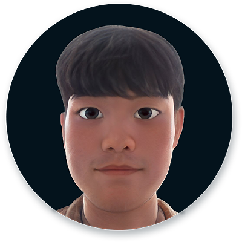
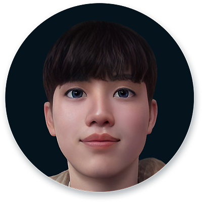

# KMWP (<b>K</b>orean <b>M</b>ath <b>W</b>ord <b>P</b>roblems)

본 데이터셋은 [TUNiB](http://tunib.ai)이 [2021 인공지능 그랜드 챌린지](https://www.ai-challenge.kr/) 5차대회 수학 문제풀이 트랙에 참가하기 위해 자체적으로 제작한 데이터셋입니다. 이 챌린지는 임의의 수학 문제를 보고 그 수학 문제에 대한 풀이를 인공지능이 코드로 풀어내는 과제였습니다. 여느 대회와는 달리 주최측이 샘플 외에 별도로 학습 데이터를 제공하지 않아 참가팀이 스스로 데이터를 만들어야 했습니다. TUNiB도 대회를 준비하는 과정에서 crowd sourcing을 통해 학습 데이터를 제작하였습니다. 아쉽게도 입상하지는 못했습니다만, 한국어 자연어처리 발전에 기여하고자 데이터를 외부에 공개하기로 결정하였습니다.   
  
이번에 공개하는 데이터는 아래 8가지 유형의 수학 문제로 이루어져 있습니다. 
자연어로 된 수학 문제를 인풋으로 해서 그 문제를 푸는 파이썬 코드를 출력해야 합니다.
  
|유형 번호|유형|설명|  
|:-------:|---|-----|  
|1|산술연산|주어진 특성 상황에서 연산식을 구하고 원하는 값을 구하는 유형|  
|2|순서정하기|줄을 서는 상황이 주어지고 요구하는 값을 구하는 유형|  
|3|조합하기|주어진 특정 상황에서 가능한 경우의 수를 구하는 유형|  
|4|수 찾기-1|주어진 숫자 셋에서 특정 조건(가장 큰 수, 가장 작은 수 등)을 만족하는 수를 찾는 유형|  
|5|수 찾기-2|문제에 미지수(A, B, C)가 주어지고 미지수가 포함된 연산 식 조건을 만족하는 미지수를 찾는 유형|  
|6|수 찾기-3|연산을 잘못했을 때의 상황이 주어지고, 바르게 연산했을 때의 결과를 찾는 유형|  
|7|크기 비교|주어진 상황에서 상대적인 크기를 비교하여 어떤 것이 더 큰 지를 찾는 유형|  
|8|도형|서술식으로 주어진 도형에 대한 문제의 해를 구하는 유형|  
  
<B>테스트 데이터는 추후 빠른 시일 내에 추가 공개 예정입니다.</b>
    
## Quick peek
  

      
## Basic Statistics
 
|클래스|# Training|# Test |
|:----:|:------:|:------------:|
|산술연산 | 1000    | 100   |
|순서정하기  |30     | 3 |
|조합하기  |200     |20|
|수 찾기-1  |240     |24|
|수 찾기-2  |200     |20|
|수 찾기-3 |150      |15|
|크기 비교 | 200 |20|
|도형 | 800 |80|

  
## Authors in TUNiB
  
|금빛나|류명현|함요셉|서민서|
|:---------------:|:---------------:|:-------------:|:-------------:|  
|||||  
|**[Bitna Keum](https://github.com/BitnaKeum)**|**[Myeonghyeon Ryu](https://github.com/ryubright)**|**Yoseph Ham**|**[Minsuh Seo](https://github.com/smsail)**|
  
|조희창|김한결|박규병|
|:---------------:|:---------------:|:-------------:|
||||  
|**Heechang Jo**|**Hangyeol Kim**|**[Kyubyong Park](https://github.com/kyubyong)**|
  
## License
  
This dataset is licensed under a [CC-BY-NC-SA 4.0 License](https://creativecommons.org/licenses/by-nc-sa/4.0/deed.ko).
  
## Citation
  
```
@misc{KMWP
  author       = {Keum, Bitna and Ryu, Myeonghyeon and Ham, Yoseph and Seo, Minsuh and 
                  Jo, Heechang and Kim, Hangyeol and Park, Kyubyong},
  title        = {KMWP, Korean Math Word Problems},
  howpublished = {\url{https://github.com/tunib-ai/KMWP}},
  year         = {2022},
}
```
